# CAFA-Claude Code Coding Agent

The operational core of the **CAFA Custom AI Coding Agent**. This directory is the
concrete, file-based realization of the **LLM Wiki** direction described in the
repository root (`../README.md`): a small instruction core plus a retrievable knowledge
base, kept in distinct layers so the agent grounds CAFA syntax in truth instead of
hallucinating it.

Its job is to turn a user request into two artifacts:

- a **Blueprint** — the design of a CAFA agent, and
- **CAFA Agent Code** — valid, executable CAFA agent JSON generated from the Blueprint.

# Claude Code Installation
- Prerequisite: Claude Account
## (Windows) Windows Native Installer (Recommended)
This is recommended by Official Claude Code Document written by Anthropic.

1. Install [git for Windows](https://git-scm.com/install/windows). Click the hyperlink at the end of the arrow.
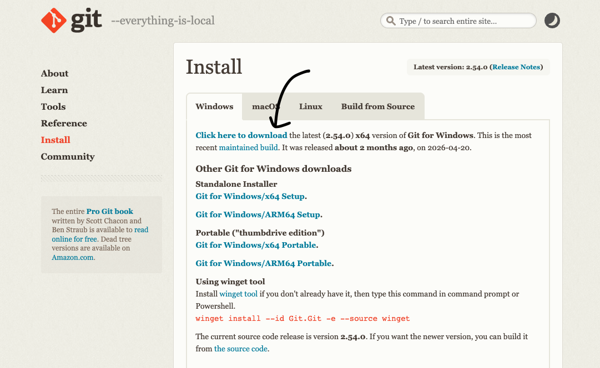
* you may click "enter" until you reach to the installation process for configuration. It does not affect the claude code usages. Change your git configuration if you wish so.
* After the installation, you will be able to use `claude` command to start your claude code session on Powershell, CMD, and Git Bash.

2. Install claude code using native installer <br><br>
Press `Win` key, search `PowerShell`, and press Enter.<br><br>
Copy & Paste this command below once you opened up `Powershell`:
     ```Powershell
     irm https://claude.ai/install.ps1 | iex
     ```
* *Note: Do not confuse with Windows CMD. The installing command and the environment of Powershell is different from CMD.*
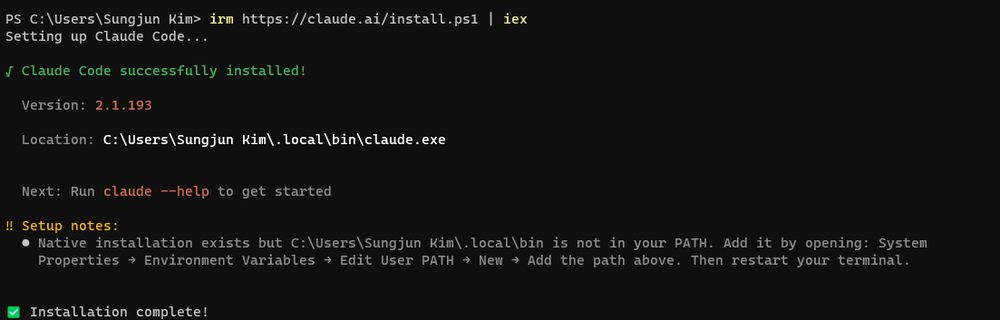

3. Add Claude to your Environment PATH<br>
We need to add the installation script to start claude code in any folder and with any Command Line Interface (CLI; e.g. Powershell, CMD, Git Bash, terminal (for MacOS))
     1. Press `Win + R`, type `sysdm.cpl` and hit enter.<br>
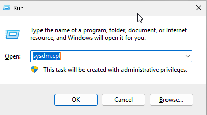
     2. Go to `Advanced` tab and click Environment Variables<br>
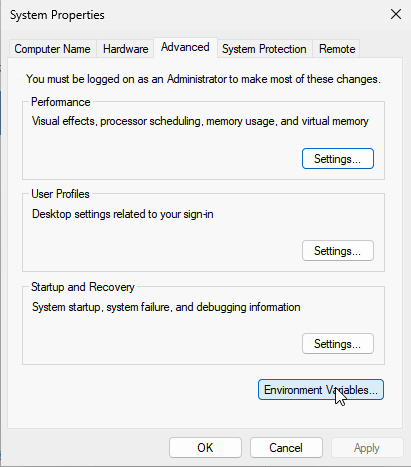
     3. Click `Path` and click `Edit...`
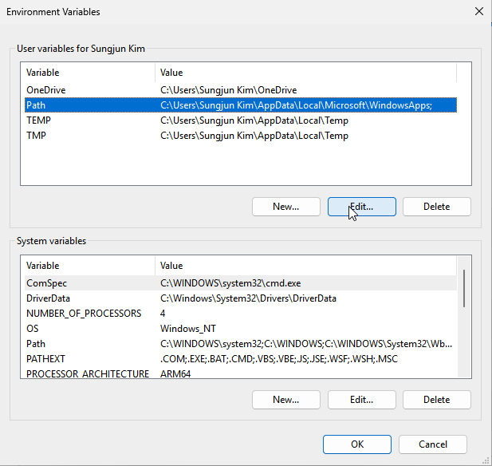
     4. Click `New` and write the following Path on the left arrow. Once you typed in your path, press `Enter` and click `OK`. The Path syntax is the following:
     ```Powershell
     C:\Users\Username\.local\bin
     ```
     *Note: if you don't know your `Username`, refer 3-2. Install claude code using native installer section. the `Location` on the powershell image shows you your exact username. In this example, the Username is `Sungjun Kim`*<br>
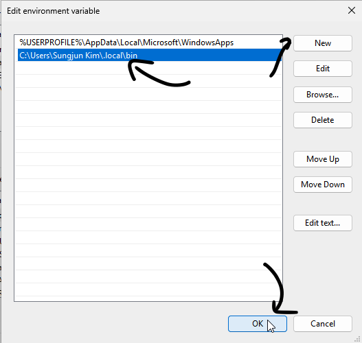<br>
     5. Click ok for all tab. The Environment Variable setup is complete.

4. Create a folder or directory
To test our friend claude code, create a folder for claude code to play around!
For example, I'll create `dev` folder on `Desktop`. Make sure you are strict about where you create your folder! Does not really matter where you create one but it matters for claude code and us to initiate claude code on CLI!

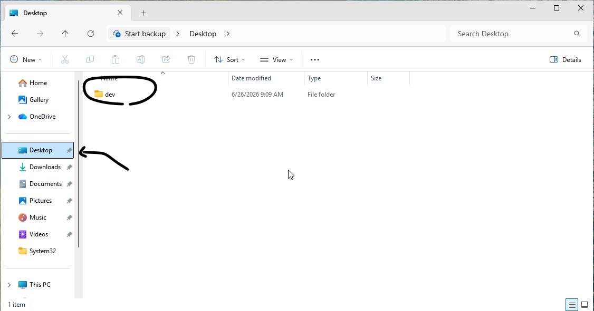

5. Find your folder on Powershell and start claude code
By Default, you will be at `PS C:\Users\Username`
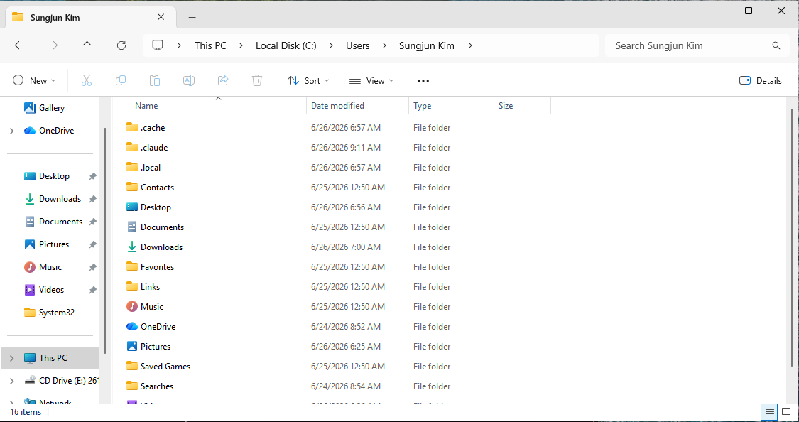<br>
<br>
If you created the folder on `Desktop`, here is the following command to go to your folder on Powershell:<br>

```Powershell
cd .\Desktop\your_folder_name\
```

Now you are on the right folder, write the following command to start claude code:<br>
```
claude
```
<br>
This will automatically prompt several choice of your UI and other settings. Just to use the claude code, you can just hit enter.

#### Login (via Claude Account)
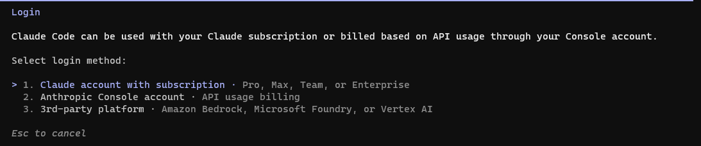<br>
At some point, you will be prompt to login with your Anthropic or claude account. If you are a subscriber (Pro, Max, or Enterprise plan), go ahead with option 1: Use your Claude account to log in and follow their instructions.

#### Login (via Anthropic Console account)
If you are not a subscriber, you will have to go with option 2: log in via Anthropic API.

1. type the following command to login via Anthropic API:
     ```Powershell
     /login
     ```
     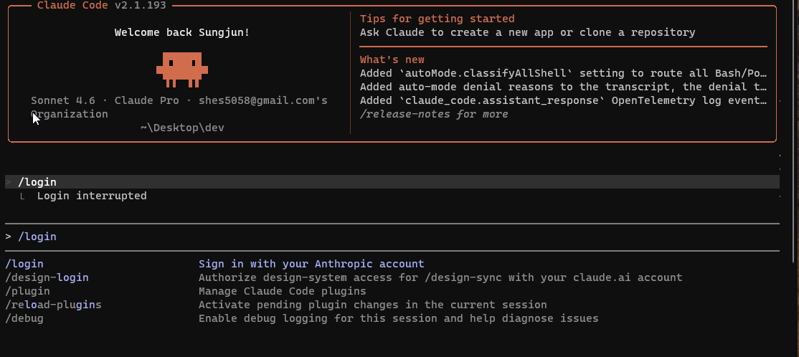<br>

2. Use your navigation keys to select "Anthropic Console account and hit Enter.
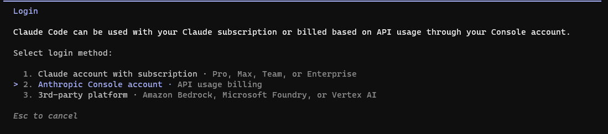

3. You will be directed to the webpage that you can log into your Claude Account. Follow their instructions to continue logging in. 
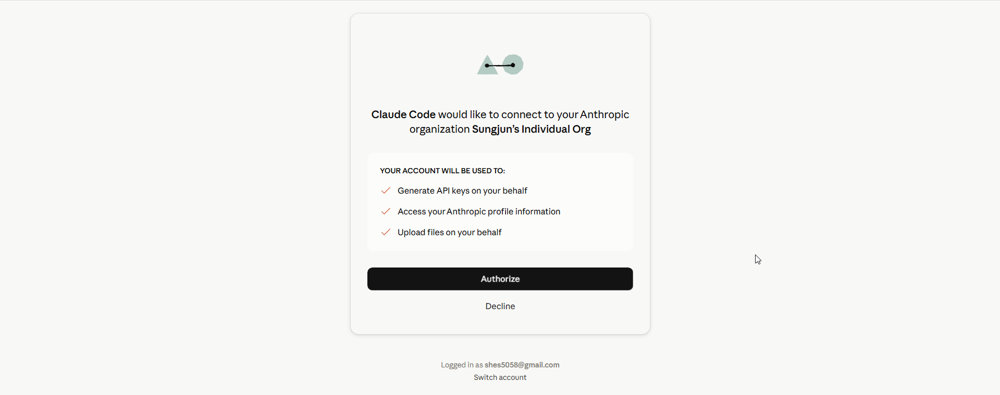<br>
*In case the webpage is not prompted:*<br>
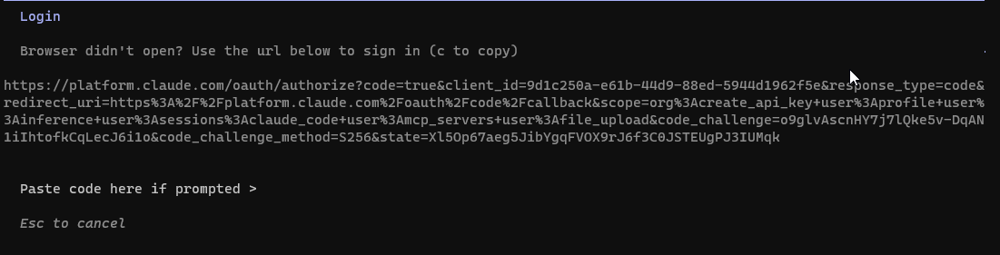<br>
     - Sometimes you will need to copy and paste authentication code to your CLI to log in. Don't panick if you don't see what you have pasted on your CLI when you brought the auth code! It is completely normal and it is for security matter. After you copied and pasted the auth code, please hit enter and you should be all set!

4. If this is your first time using Anthropic API or consumed all your token limits for your API key, you may have to add extra dollars on your account before you start using claude code with your API!


     *We recommend adding $5 for a starter. The token usage speed may heavily depend on your requests, the contexts, task complexity, etc.*<br>
<br>

5. Setup complete! you may go back to your claude code and enjoy coding with our pal, Claude Code!
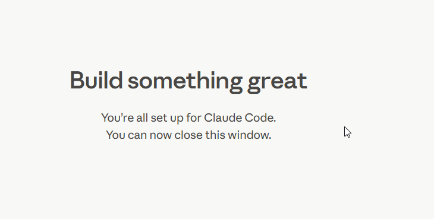

# Claude Code Uninstallation
## (Windows) Windows Native Installer
1. Uninstall all the files created by the Native installer
All files created by the Native installer is in `.claude` folder. <br>
We have to delete the `.claude` folder to uninstall claude code.
<br>
Copy and paste the code below to the powershell:
```Powershell
Remove-Item -Recurse -Force "$env:USERPROFILE\.claude"
```

2. Delete `Claude` Environment Variable from the local

     1. Press `Win + R`, type `sysdm.cpl` and hit enter.<br>

     2. Go to `Advanced` tab and click Environment Variables<br>

     3. Click `Path` and click `Edit...`

     4. Click the Environment Variable we created when we installed Claude Code, click Delete, and click OK. The Path or Environment Variable syntax is the following:
          ```Powershell
          C:\Users\Username\.local\bin
          ```

          <br>
     5. Click ok for all tab. The Environment Variable and Claude Code delete is complete.

3. Varify if Claude Code is not in your local machine
Close all Powershell tab and relaunch it. Copy and paste the following code on the reopened Powershell tab:
```Powershell
claude
```
If you see `CommandNotFoundException` Error that looks like below, the Uninstallation is successful!:
```Powershell
claude : The term 'claude' is not recognized as the name of a cmdlet, function, script file, or operable program.
Check the spelling of the name, or if a path was included, verify that the path is correct and try again.
At line:1 char:1
+ claude
+ ~~~~~~
    + CategoryInfo          : ObjectNotFound: (claude:String) [], CommandNotFoundException
    + FullyQualifiedErrorId : CommandNotFoundException
```

# CAFA Coding Agent Installation
CAFA Coding Agent Configuration and Setup does not difer depending on the Operating System of your local machine. (e.g. MacOS, Windows, Linux, etc.)

- Any text editor or Integrated Development Enviroment (IDE) would be recommended.
     - VSCode(IDE) + Obsidian(TextEditor) (Recommended)
     - Vim
     - Notepad++

- Installing `Obsidian` is strongly recommended for managing Markdown files (Relational Database)

1. Go to [CAFA Coding Agent Github Repository](https://github.com/Sungjun-Kim566/CAFA-Custom-AI-Coding-Agent-Codebase).
     - If you use `git`, then you may proceed cloning the repository.
     - otherwise, you can click `Code` on the right arrow and click `Download zip`.
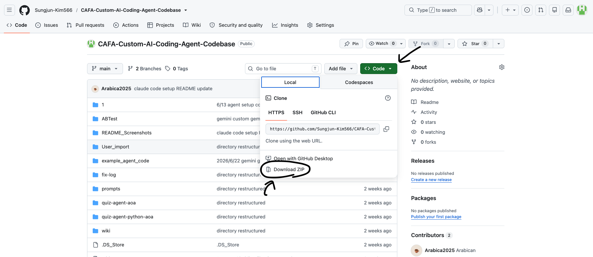
2. You may unzip the file and move the following folders to your developing folder:
```markdown
agent-config/
├─ AGENTS.md  # Agent Core: Identity · Workflow · Retrieval instructions
│
├─ prompts/               # Workflow instruction strings, one per stage/role
│  ├─ coding-agent.md     #   design + code  (Blueprint, ontology, turns, command rules)
│  ├─ validator.md        #   verify         (pre-code, parser-critical checklist)
│  └─ reviewer.md         #   review/revise  (final JSON gate + output packaging)
│
├─ wiki/                  # Knowledge Base (retrieval targets) — grounding source
│  ├─ index.md            #   KB routing table — retrieval ALWAYS starts here
│  ├─ protocol.md         #   full command/syntax reference (authoritative)
│  ├─ linter.md           #   schema, allowed keys, parser rules (authoritative)
│  └─ examples/
│     └─ code-bank.md     #   known-good agent archetypes to adapt
│
└─ User_import/ # User projects the agent inspects / edits; put your data in this folder 
```

### Optional: If you created your directory or folder at choice of yours
If you created your folder in different location, here are some commands that can be useful to find your folder or directory:
```
cd PATH: go to the specified path
ls: look at what's inside current location 
```
### Example codes
Currently at `PS C:\Users\Sungjun Kim`
```Powershell
ls
```
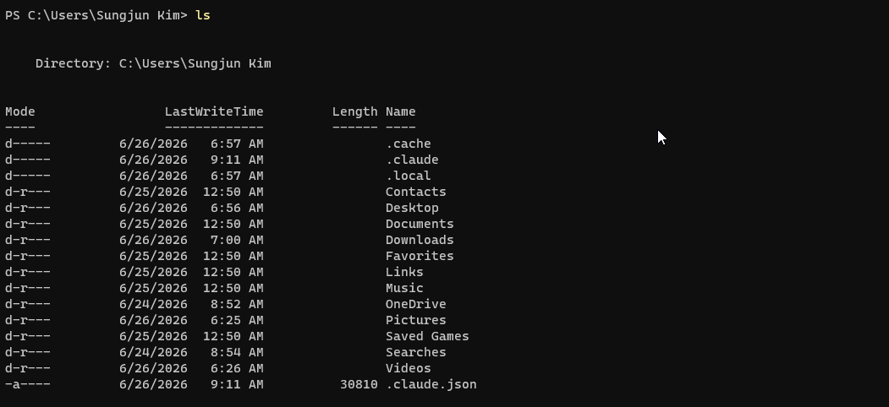

```Powershell
cd .\Desktop\dev\
ls
```
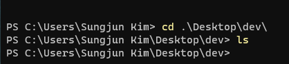<br>
*there is nothing in `dev` folder so `ls` command shows you nothing.*
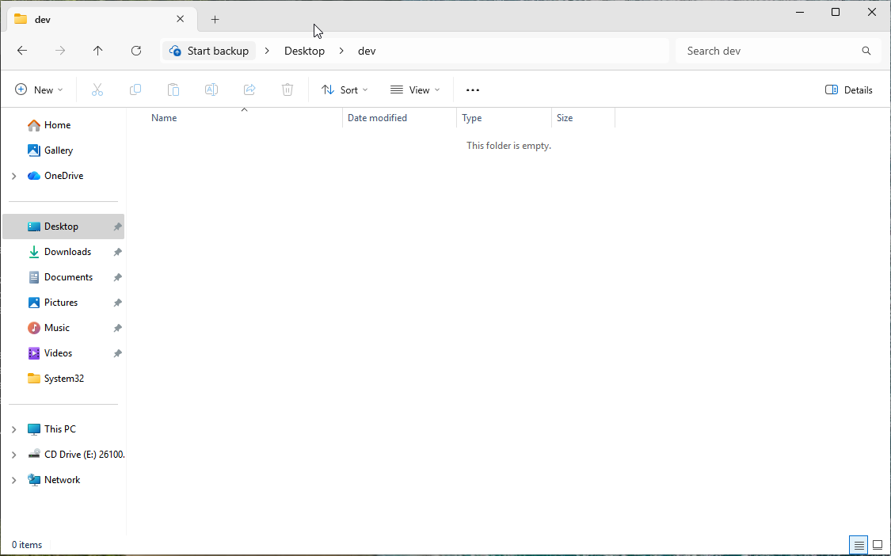

---

## Layer separation

```
┌─────────────────────────────────────────────────────────────────┐
│                      AGENTS.md  (Agent Core)                    │
│               Identity · Workflow · Retrieval rules             │
└──────────┬──────────────────────┬──────────────────────┬────────┘
           │                      │                      │
           ▼                      ▼                      ▼
┌───────────────────────┐ ┌───────────────────┐ ┌───────────────────────┐
│  Workflow Prompts     │ │  Tools            │ │  Knowledge Base       │
│  (how to work)        │ │  (fast routing)   │ │  (what is true)       │
├───────────────────────┤ ├───────────────────┤ ├───────────────────────┤
│ • coding-agent.md     │ │ • code_eg_router  │ │ • index.md  (routing) │
│     (design + code)   │ │     .py — keyword │ │ • protocol.md (syntax │
│ • validator.md        │ │     match into    │ │     truth)            │
│     (verify)          │ │     code-bank.md  │ │ • linter.md (rules/   │
│ • reviewer.md         │ │                   │ │     schema)           │
│     (review/revise)   │ │                   │ │ • code-bank.md        │
│                       │ │                   │ │     (archetypes)      │
└──────────┬────────────┘ └─────────┬─────────┘ └──────────┬────────────┘
           │                        │                      │
           └────────────────────────┼──────────────────────┘
                                    ▼
┌─────────────────────────────────────────────────────────────────┐
│           projects/<agent-slug>/  (per-agent working state)     │
│   blueprint.md · agent.json · local-code-bank.md · code-log.md  │
└─────────────────────────────────────────────────────────────────┘
         fix-log/ (growing memory)   ·   User_import/ (user data)
```

- **Instructions** (`AGENTS.md` + `prompts/`) stay small and stable — they describe *how*
  the agent works.
- **Knowledge** (`wiki/`) is the retrieval target — the authoritative *what is correct*.
  `tools/code_eg_router.py` keyword-routes into `code-bank.md` so the agent loads only
  the relevant example metadata instead of the whole file.
- **Working state** (`projects/<agent-slug>/`) persists every build — the verified
  Blueprint, the latest `agent.json`, the local code bank it was built from, and a dated
  iteration log. Debugging and revision requests start here, **not** at the KB.
- **Memory** (`fix-log/`) grows over time — resolved bugs and reusable techniques,
  folded back into `wiki/` when generalizable.

This mirrors the root architecture's core idea: do **not** pour everything into the
prompt; keep a small instruction file plus selective, grounded retrieval — and cache
per-agent context in its workspace so revisions don't re-route the master KB.

## Directory map

```text
home directory
├── AGENTS.md  # Coding Agent Persona Configuration
|
├── prompts/
│   ├── coding-agent.md        # Drives the design & code generation workflow (Blueprint creation)
│   ├── reviewer.md            # Reviews, re-validates JSON, and packages the final response
│   └── validator.md           # Validates Blueprint against parser-critical rules before JSON generation
│
├── tools/
│   └── code_eg_router.py      # Routes user requests to the most relevant code examples
│
├── wiki/
│   ├── index.md               # Central routing table for knowledge retrieval
│   ├── protocol.md            # CAFA protocol reference (JSON structure, AP/SP/JP, syntax)
│   ├── linter.md              # Syntax rules, best practices, linting checklist
│   └── code-bank.md           # Code metadata, architectures, frameworks, and conventions
│
└── projects/      # user playground; it grows/shrinks as user works on each project
    └── <agent-slug>/
        ├── blueprint.json     # Generated Blueprint specification
        ├── code/              # Current implementation
        ├── code-bank/         # Agent-specific local code examples
        └── iteration-log.md   # Revision and debugging history
```

## 1. The Agent Core (`AGENTS.md`)

Holds only **Identity**, **Workflow**, and **Retrieval instructions** — deliberately
small. Detailed instruction strings live in `prompts/`; framework knowledge lives in
`wiki/`. Every output must be **grounded** (in retrieved KB content), **logically
coherent** (turn-by-turn, dependency-safe), **syntactically valid** (parser-safe JSON +
correct quoting), and **reproducible**.

Operating rules (paraphrased):

1. Never assume syntax — ground it in `wiki/`.
2. Start retrieval at `wiki/index.md`.
3. Read only relevant files.
4. Respect turn-based structure before editing.
5. Preserve project conventions.
6. Validate after every edit.

## 2. The Workflow Prompts (`prompts/`)

Each file drives one stage of the pipeline and points back at the authoritative `wiki/`
sources:

| Prompt | Stage | Responsibility |
|--------|-------|----------------|
| `coding-agent.md` | design · code | Blueprint-first design (goal, framework, commands, ontology, turn plan), then generate the JSON. |
| `validator.md` | verify | Validate the Blueprint against parser-critical rules **before** coding (AP/JP specified, symbolic-vs-LLM separation, control-flow isolation, one input per visible turn, dependency next-turn rule). |
| `reviewer.md` | review · revise | Re-validate the final JSON (root/allowed keys, `model:null` on symbolic turns, `REPEAT`/`JUMP`/`END` isolation, no same-turn dependency), revise until it passes, package output. |

## 3. Tools that can help LLM (`tools/`)
Each script is a helper for LLM for <br>
     1. reduction in token usage<br>
     2. faster inference without trivial workloads consumed by LLM<br>
     3. etc.<br>
| Script | Stage | Function |
|--------|-------|----------|
| `code_eg_router.py`| retrieval | Static, index-matching script based on the extracted keyword input from the client; returns the metadata of each section corresponding to the keywords weighted for best matching|


## 4. The Knowledge Base (`wiki/`)

The retrieval layer — authoritative CAFA truth. **Always start at `index.md`**, then open
the file that answers the question:

| Entry | File | Use when |
|-------|------|----------|
| CAFA Protocol | `protocol.md` | Exact command syntax, quoting, turn triggers, parameter systems (AP/SP/JP), loop-result indexing. |
| Linter & Rules | `linter.md` | Schema / allowed keys, symbolic-vs-LLM requirements, escaping, dependency rules, parser compliance. **Overrides examples.** |
| Agent Code Bank | `code-bank.md` | Finding a working archetype (router, loop, evaluator, scorer, sandwich quiz, adaptive test) to adapt. |

Precedence: `linter.md` and `protocol.md` are authoritative and **override any example**.
Grounding rule: if a CAFA behavior claim cannot be supported by these files, label it an
assumption or omit it.

## 5. Growing Memory (`fix-log/`)

Dated logs of resolved bugs, migrations, and reusable techniques. When a session uncovers
a non-obvious rule or pattern, it is captured here (and, when generalizable, folded back
into `wiki/`). Example: `2026-06-13-loop-result-indexing.md` documents the
`@TR@TN(-1)@[@R_i@]@` loop-result-indexing trick, which was promoted into `protocol.md`
(§8.1), `linter.md`, and `code-bank.md`.

# Workflow

Driven by `AGENTS.md`, every request follows the same order. No stage is skipped; if
verify or review fails, revise **Blueprint → ontology → turn architecture → code** and
re-run the stage.

```txt
User Request
     ↓
retrieve   →  wiki/index.md → protocol.md / linter.md / examples/code-bank.md / code_eg_router.py
     ↓
design     →  prompts/coding-agent.md   (produce the Blueprint)
     ↓
verify     →  prompts/validator.md      (check Blueprint before coding)
     ↓
code       →  prompts/coding-agent.md   (write CAFA agent JSON)
     ↓
review     →  prompts/reviewer.md       (re-validate, revise, package)
     ↓
Return Blueprint + CAFA Agent Code
```

This is the same `Search → Generate → Validate → Repair → Revalidate` loop the root
README argues for — retrieval grounded in `wiki/`, correctness enforced by the
validator/reviewer prompts.